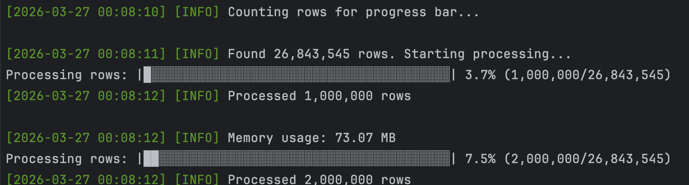
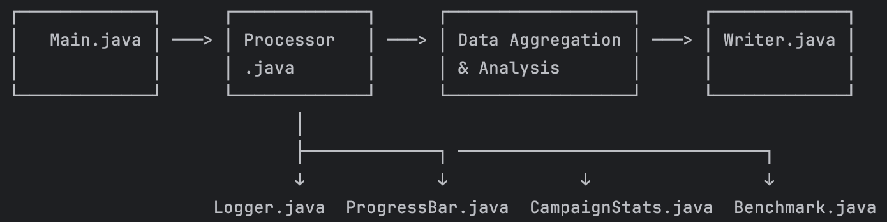

To run this program:
1, Use docker
# Build the image
docker-compose build
# Run with ad_data.csv file in root directory
docker-compose run csv-processor ad_data.csv
2, Without docker:
# Delete previously built artifacts and then compile, test, and package
# target/csv-processor-1.0-SNAPSHOT.jar
mvn clean package
# With ad_data.csv in root directory
java -jar target/csv-processor-1.0-SNAPSHOT.jar ad_data.csv

Running

Architecture                                                                                                                                                                
├── Main.java           # Entry point & argument validation
├── Processor.java      # Core processing logic & aggregation
├── CampaignStats.java  # Campaign metrics data model
├── Writer.java         # Output file generation
├── Logger.java         # Colored logging utility
├── ProgressBar.java    # Visual progress tracking
└── HeapEntry.java      # Record for heap sorting

Libraries used:
1. Apache Commons CSV (1.10.0): Processor.java
2. Fastutil (8.5.13): Processor.java

Processing time for the 1GB file: ~ 17 seconds. (can be faster if don't 
use progress bar and merge 2 function generateTopHighestCtr and 
generateTopLowestCpa into one)
Peak memory usage:
- ~133MB without docker.
  - ~240MB with docker.

    Overview:
    This is a high-performance Java application that processes large CSV files containing advertising campaign data and generates two output files:
      - top10_ctr.csv - Top 10 campaigns by Click-Through Rate (CTR)
      - top10_cpa.csv - Top 10 campaigns by lowest Cost Per Acquisition (CPA)

    Architecture & Flow
  
  
    Process summary:
  - Entry Point (Main.java): Checks file exists, is readable, and is a regular file.
  - Get ready:
    + Creates 4 specialized HashMaps using Fastutil for memory efficiency.
    + Progress bar: Counts newlines in binary mode, returns total rows for 
      progress bar. (could be faster without it)
  - Core Processing (Processor.java):
    + For each CSVRecord:
      ├── Parse: campaign_id, impressions, clicks, spend, conversions
      ├── Aggregate data per campaign_id using primitive maps
      ├── Skip and log error very record with wrong data type
      ├── Update progress bar every 100K rows
      └── Log memory usage every 1M rows
  - Data Analysis (Processor.java):
    + Top 10 Highest CTR:
      *  Use PriorityQueue (min-heap of size 10) to keep only 10 highest CTR
    + Top 10 Lowest CPA:
        *  Use PriorityQueue (max-heap with negative values)to keep only 10 lowest
    + The program can run faster if two functions are combined into one
  - Output (Writer.java):
    + Handles null CPA values: set value to string "null"